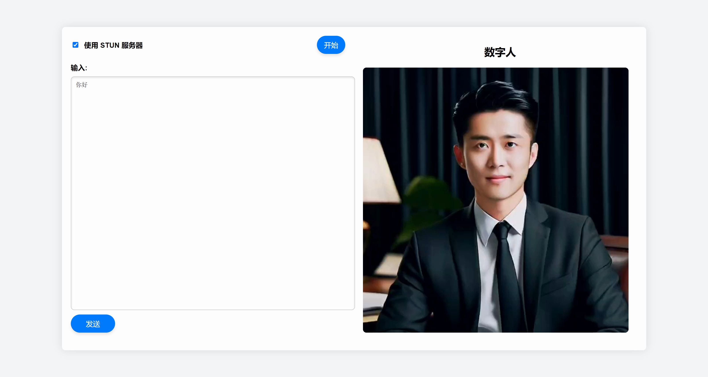

Real time interactive streaming digital human， realize audio video synchronous dialogue. It can basically achieve commercial effects.  
实时交互流式数字人，实现音视频同步对话。基本可以达到商用效果

本项目是参考的

https://github.com/lipku/metahuman-stream
对源项目进行了部分修改，重新训练了新的模型，重构了前端界面


 [wav2lip效果]
 

## Features
1. 支持多种数字人模型: ernerf、musetalk、wav2lip
2. 支持声音克隆
3. 支持数字人说话被打断
4. 支持全身视频拼接
5. 支持rtmp和webrtc
6. 支持视频编排：不说话时播放自定义视频

## 1. Installation

Tested on Ubuntu 20.04, Python3.10, Pytorch 1.12 and CUDA 11.3

### 1.1 Install dependency

```bash
conda create -n nerfstream python=3.10
conda activate nerfstream
conda install pytorch==1.12.1 torchvision==0.13.1 cudatoolkit=11.3 -c pytorch
pip install -r requirements.txt
#如果只用musetalk或者wav2lip模型，不需要安装下面的库，下面的如果有一些安装不上，应该也不是很影响使用
pip install "git+https://github.com/facebookresearch/pytorch3d.git"
pip install tensorflow-gpu==2.8.0
pip install --upgrade "protobuf<=3.20.1"
```
如果用pytorch2.1，torchvision用0.16（可以去torchvision官网根据pytorch版本找匹配的）,cudatoolkit可以不用装  
安装常见问题[FAQ](/assets/faq.md)  
linux cuda环境搭建可以参考这篇文章 https://zhuanlan.zhihu.com/p/674972886


## 2. Quick Start
默认采用ernerf模型，webrtc推流到srs。 
但是我是改用了wav2lip模型 ，用的rtcpush推流，只需要按照以下步骤执行即可，需要一台安装docker的服务器和一台有GPU的服务器

### 2.1 运行srs（在一个安装了docker的服务器上输入下面的指令）
```
export CANDIDATE='<服务器外网ip>'
docker run --rm --env CANDIDATE=$CANDIDATE \
  -p 1935:1935 -p 8080:8080 -p 1985:1985 -p 8000:8000/udp \
  registry.cn-hangzhou.aliyuncs.com/ossrs/srs:5 \
  objs/srs -c conf/rtc.conf
```

### 2.2 修改前端文件  rtcpushapi.html
1.修改提示词，默认设置成一个AI面试官“你是一名经验丰富的面试官xxx”，可以改成自己想要的

2.API_URL：https://open.bigmodel.cn/api/paas/v4/chat/completions，我用的是glm4，可以改成其他的

3.API_KEY，改成自己的key，目前是暴露key在前端界面，后续有重构到后端的想法，不过目前可以满足展示的效果，不影响使用

4.docker服务器ip：      
有一行代码的
```
var url = "http://<docker服务器ip>:1985/rtc/v1/whep/?app=livestream=livestream"
```
要改成上面的那个服务器的ip，记得开放端口tcp:8000,8010,1985; udp:8000

### 2.3 启动数字人（在有GPU的服务器也就是配置了这个项目的服务器上执行下面的指令）：

```python
python app.py --model wav2lip --avatar_id wav2lip_avatar1 --transport rtcpush --push_url 'http://<上面的那个docker服务器外网地址>:1985/rtc/v1/whip/?app=live&stream=livestream' --listenport 8080 --batch_size 32
```

如果访问不了huggingface，在运行前
```
export HF_ENDPOINT=https://hf-mirror.com
```

用浏览器打开http://serverip:8010/rtcpushapi.html, 在文本框输入任意文字，提交。数字人回复提的问题  
备注：服务端需要开放端口 tcp:8000,8010,1985; udp:8000

## 3. More Usage
使用说明: <https://livetalking-doc.readthedocs.io/>
  


## 4. 性能分析
1. 帧率  
在Tesla T4显卡上测试整体fps为18左右，如果去掉音视频编码推流，帧率在20左右。用4090显卡可以达到40多帧/秒。  
优化：新开一个线程运行音视频编码推流  
2. 延时  
整体延时3s左右  
（1）tts延时1.7s左右，目前用的edgetts，需要将每句话转完后一次性输入，可以优化tts改成流式输入  
（2）wav2vec延时0.4s，需要缓存18帧音频做计算 
（3）srs转发延时，设置srs服务器减少缓冲延时。具体配置可看 https://ossrs.net/lts/zh-cn/docs/v5/doc/low-latency


## 5.参考及鸣谢

本项目是参考的

https://github.com/lipku/metahuman-stream
